### Anggota Tim

| No | Nama |
|----|------|
| 1 | Chyntia Claudia (231401006) |
| 2 | Dini Sahfitri (231401033)   |
| 3 | Felice Yovita (231401045)   |

---

# EduPin 
EduPin adalah aplikasi mobile berbasis Android yang digunakan untuk menyimpan, mencari, mengatur, dan berbagi materi pembelajaran visual dalam satu aplikasi. Materi pembelajaran tersebut dapat berupa mind map, infografis, dan rangkuman digital yang diunggah oleh para pengguna.

---

### 📱 Deskripsi Produk

EduPin dikembangkan untuk menjawab permasalahan umum pelajar dalam mengelola sumber belajar yang tersebar dan sulit diakses. Melalui Edupin, pengguna dapat mengunggah, mencari, menyimpan, dan mengorganisasi konten pembelajaran visual sesuai kebutuhan mereka.

---

### Tujuan Aplikasi

- Membantu pelajar menyimpan dan mengatur catatan belajar dengan lebih rapi
- Mempermudah pencarian materi pembelajaran visual
- Menyediakan tempat untuk berbagi dan menemukan catatan belajar
- Mendukung proses belajar mandiri dan kerja sama antar pelajar  

---

### ✨ Fungsi Utama Aplikasi

#### 🔐 Registrasi dan Login Pengguna
- Registrasi akun menggunakan email dan verifikasi  
- Login untuk mengakses seluruh fitur aplikasi  
- Pemulihan kata sandi (forgot password)  

### 📝 Manajemen Konten (Catatan)
- Mengunggah materi pembelajaran visual (JPG, PNG)  
- Menambahkan detail materi: judul, deskripsi, dan tag/kategori  
- Mengedit dan menghapus catatan yang diunggah  

#### 🔎 Penemuan dan Pencarian Konten
- Menelusuri catatan terbaru dari pengguna lain  
- Pencarian berdasarkan judul, deskripsi, kategori, atau tag  

#### 📌 Kurasi Konten Personal (Papan)
- Menyimpan atau mem-pin catatan yang relevan di papan koleksi 

#### 👤 Manajemen Profil dan Interaksi
- Melihat profil pribadi dan galeri catatan  
- Memperbarui nama tampilan dan foto profil  
- Melihat profil publik pengguna lain  
- Logout dari aplikasi  

#### 🔔 Sistem Notifikasi
- Melihat riwayat notifikasi terkait akun atau konten

#### 🚨 Moderasi Konten (Pelaporan)
- Melaporkan catatan atau profil pengguna yang melanggar pedoman komunitas  

---

### 🛠️ Teknologi yang Digunakan

| Komponen | Teknologi |
|--------|-----------|
| Framework | Flutter |
| Platform | Android |
| Authentication | Firebase Authentication |
| Database | Firebase Firestore |
| Storage | Supabase Storage |
| CI/CD | GitHub Actions |
| Version Control | Git & GitHub |

---

## 📸 Preview Aplikasi EduPin

---

### Tampilan Aplikasi – Autentikasi

| Login | Sign Up | Reset Password |
|---|---|---|
| 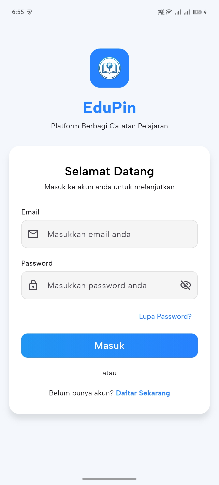 | 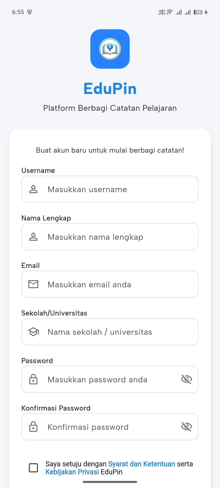 | 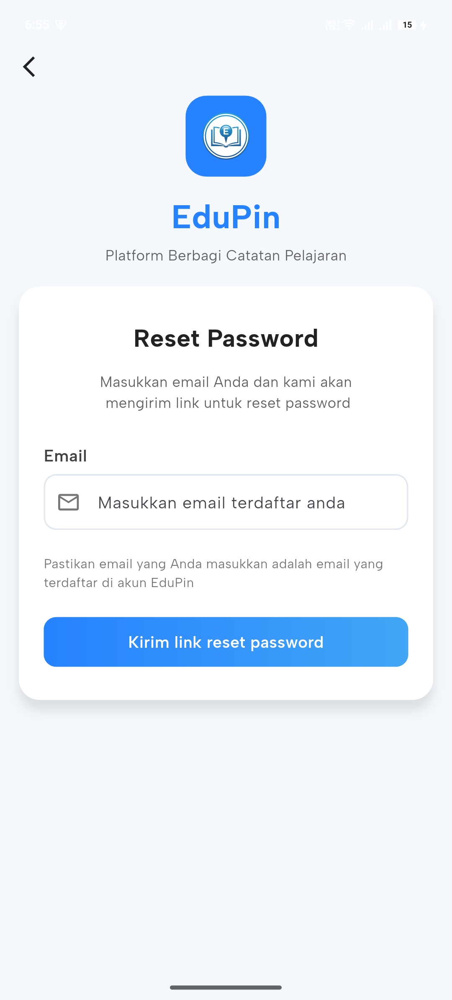 |

---

### Tampilan Aplikasi – Beranda dan Fitur Utama

| Beranda | Pilih Kategori | Detail Catatan | Author Catatan |
|---|---|---|---|
| 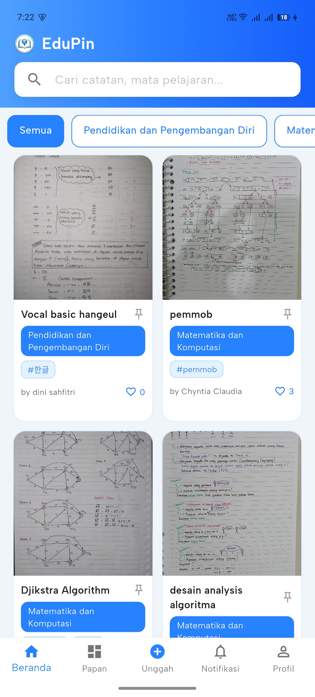 | 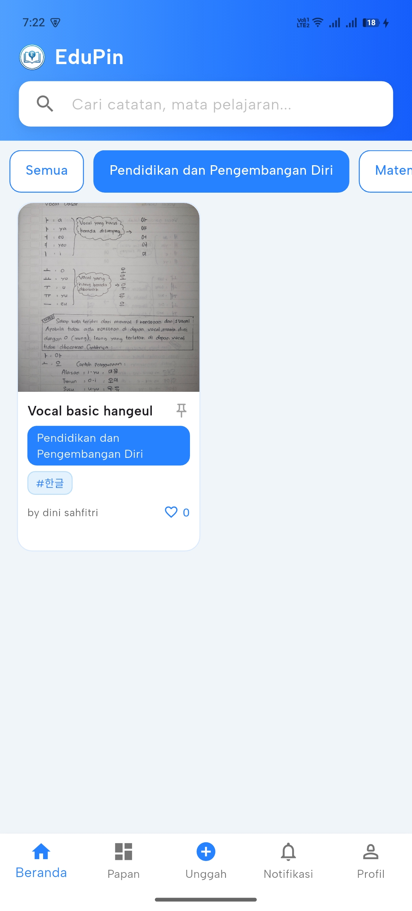 | 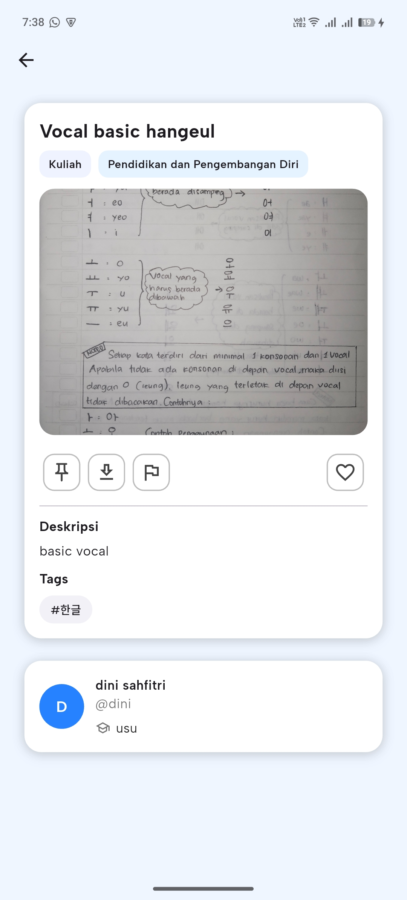 | 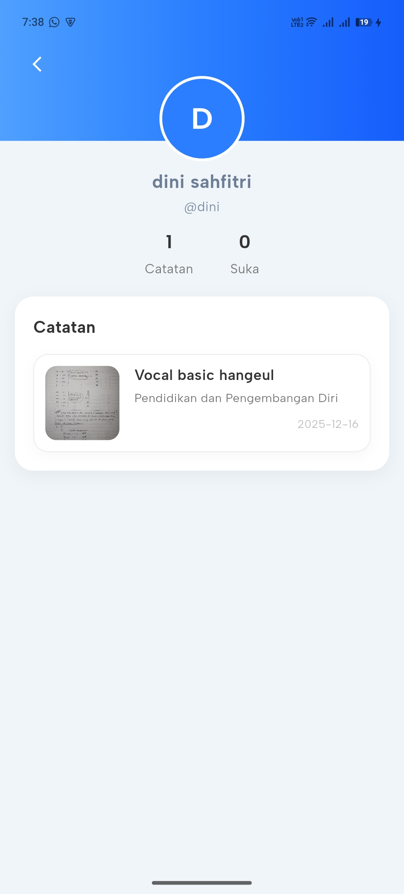 |

---

### Tampilan Aplikasi – Papan & Unggah Catatan

| Papan | Buat papan | Tambah Catatan | Field Tambah Catatan |
|---|---|---|---|
| 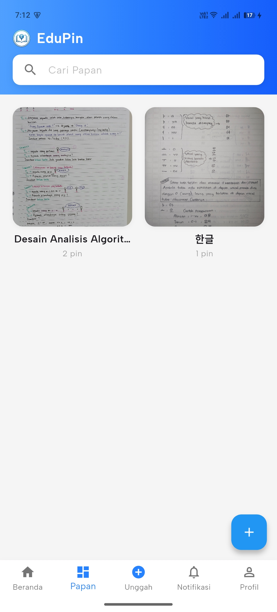 |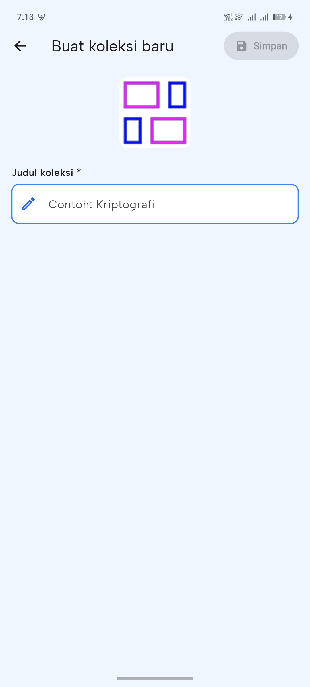 | 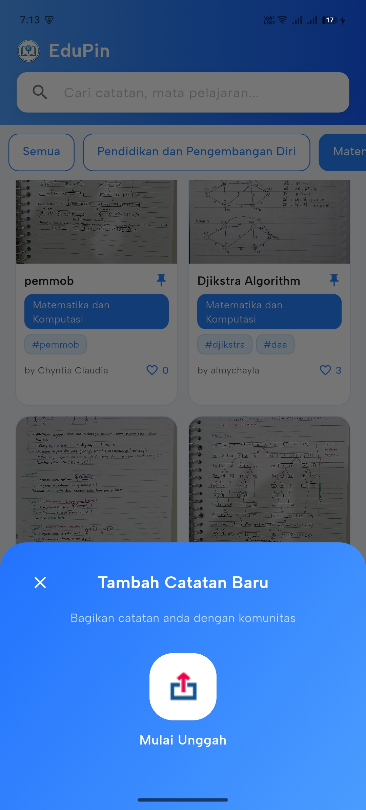 | 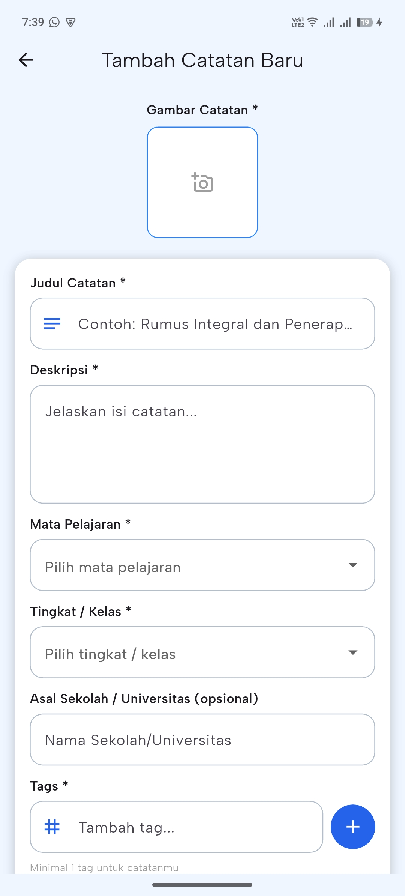 |

---

###  Tampilan Aplikasi – Notifikasi & Manajemen Profil

| Notifikasi | Profil Akun | Edit Profil | Manajemen Catatan | Pengaturan Akun | Hapus Akun | 
|---|---|---|---|---|---|
| 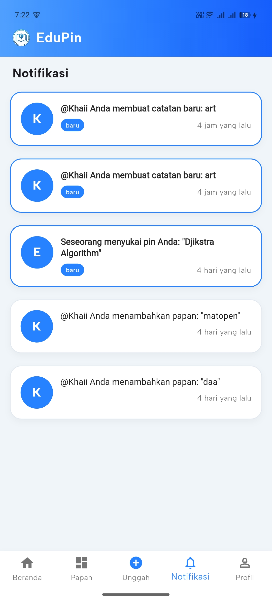 | 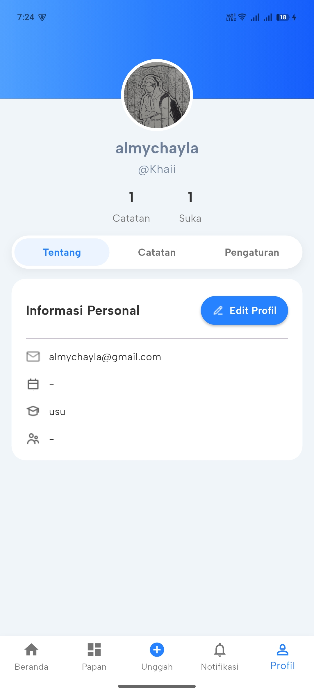 | 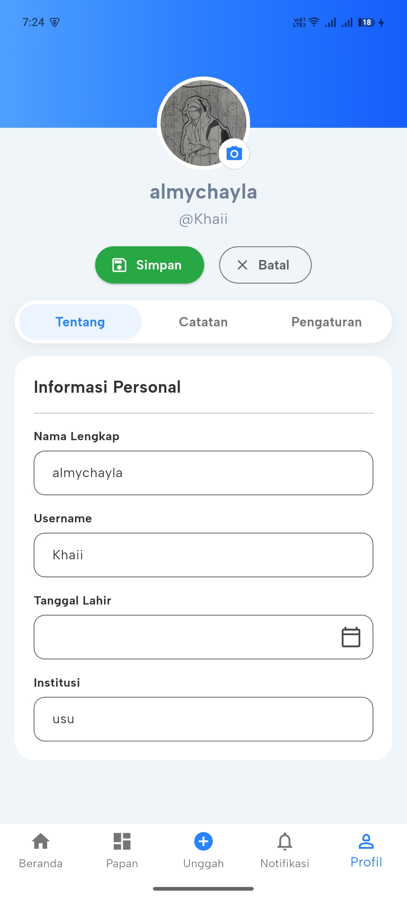 | 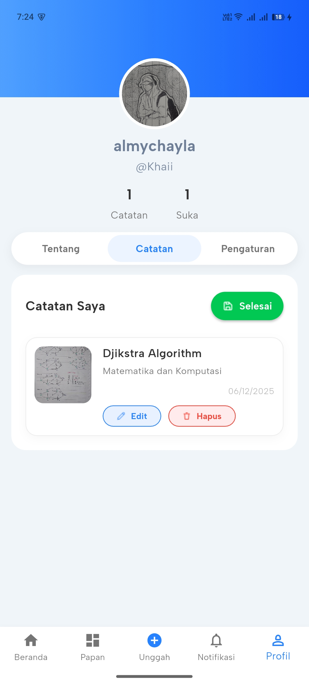 | 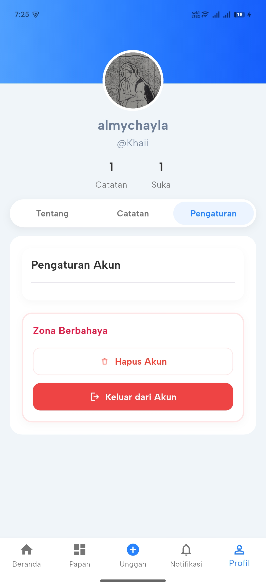 |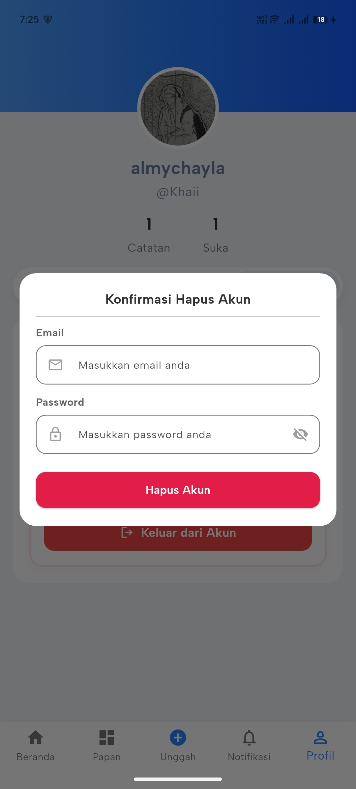 |

---
### Cara Menggunakan Aplikasi

1. Buka halaman **Releases** pada repository GitHub EduPin
2. Unduh file **APK** versi terbaru
3. Pindahkan APK ke perangkat Android
4. Aktifkan izin **Install from Unknown Sources**
5. Install dan jalankan aplikasi EduPin
